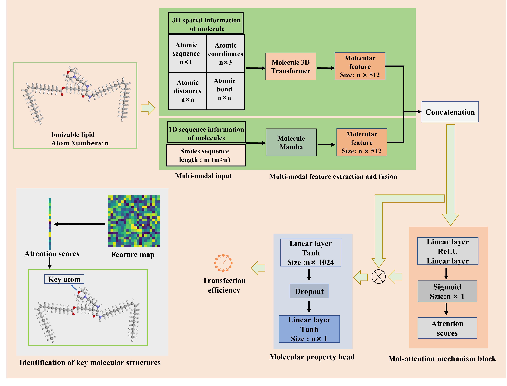

# TransMA: an explainable multi-modal deep learning model for predicting properties of ionizable lipid nanoparticles in mRNA delivery

## TransMA

TransMA is an explainable LNPs transfection efficiency prediction model, which adopts a multi-modal molecular structure fusion architecture.  

An overview of TransMA can be seen below:



## Getting Startedgit 

### Installation

Set up conda environment and clone the github repo. [Uni-Core](https://github.com/dptech-corp/Uni-Core/releases) is needed, please install it first. `unicore-0.0.1+ CU117torch2.0.0-CP39-CP39-linux_x86_64-whl` is recommended. 

```
# create a new environment
$ conda create --name TransMA python=3.9 -y
$ conda activate TransMA

# install requirements
$ pip install torch==2.0.0 torchvision==0.15.1 torchaudio==2.0.1
$ pip install -r requirements.txt
#Download pretrained weights and finetune weights
$ git clone https://github.com/wklix/TransMA.git
$ cd ./TransMA
$ wget https://github.com/wklix/TransLNP/releases/download/v1.0/mol_pre_no_h_220816.pt
$ mv *.pt weights/
# The trained models using scaffold and cliff data splitting methods from the Hela and RAW 264.7 cell line datasets are available at `https://github.com/wklix/TransMA/releases/download/v1.0/`.
#For example:
$ wget https://github.com/wklix/TransMA/releases/download/v1.0/raw_cliff.zip

```
### Training

The LNPs transfection efficiency dataset which from [AGILE](https://github.com/bowang-lab/AGILE) is derived from Hela and RAW 264.7 cell lines. You can choose between two data splitting methods: cliff and scaffold. The corresponding data is located in  `./dataset`. 

```
# ./dataset/Hela/cliff/train.csv is the path of Hela cell lines dataset under cliff data splitting method.
$ python train_model.py 
```

### Test

Run `test.py` to observe the predictive results on the test set. We provide models trained under cliff and scaffold data splitting in the Hela and RAW 264.7 cell line datasets.  The models can be found at `https://github.com/wklix/TransMA/releases/download/v1.0/`.

```
$ python test.py
```

## Acknowledgement

- AGILE: [https://github.com/bowang-lab/AGILE](https://github.com/bowang-lab/AGILE)
- Unimol: [https://github.com/dptech-corp/Uni-Mol/tree/main](https://github.com/dptech-corp/Uni-Mol/tree/main)
- Mamba: [state-spaces/mamba: Mamba SSM architecture (github.com)](https://github.com/state-spaces/mamba/tree/main)

